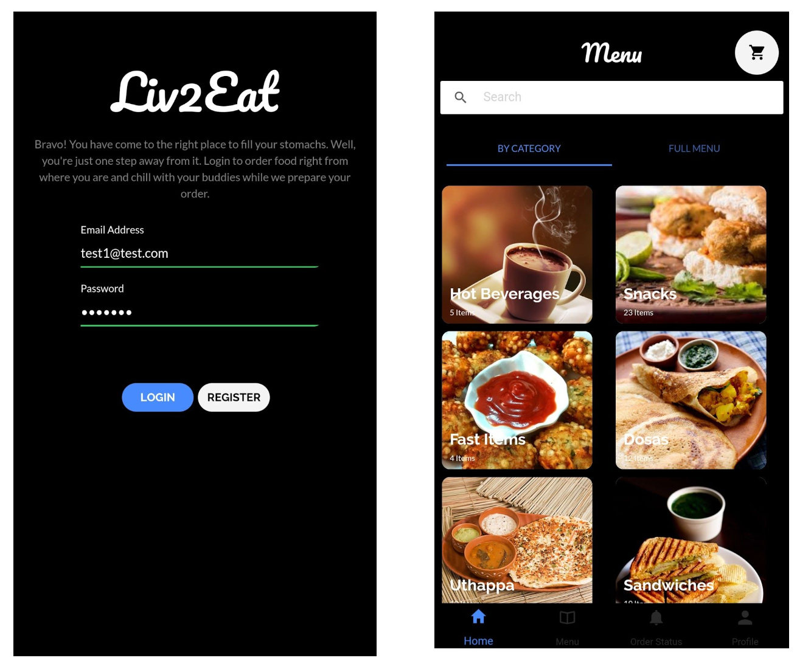
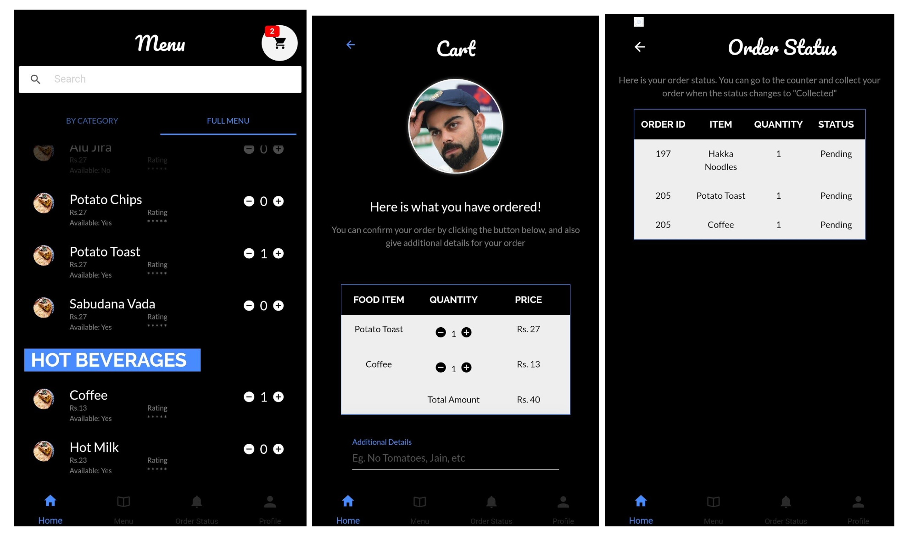
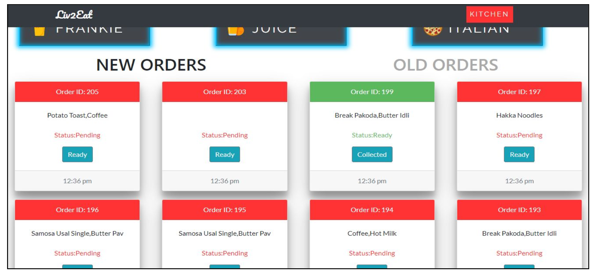

# Liv2Eat-Digitalization of Canteen

Liv2Eat is a digital solution designed to modernize the canteen experience by streamlining the process of menu display, food ordering, and payment. This system not only enhances operational efficiency but also improves customer satisfaction by reducing wait times. This solution consists of a Mobile App to order food and an adminw web application to view orders.

## Features

- **Digital Menu Display**: Users can browse the digital menu with updated items and prices.
- **Online Food Ordering**: Place orders through the app for a convenient pick-up.
- **Wallet Payment System**: Offers a digital wallet.
- **Ratings and Reviews**: Users can rate dishes and provide feedback.
- **Split Payment Option**: Allows users to split the bill with friends, directly through the app.

## Tech Stack

- **Frontend Mobile Application**: Developed using Ionic Framework.
- **Backend Admin Application**: Developed using web tehcnologies - HTML, CSS, Bootstrap and JavaScript
- **Database**: Utilizes MySQL and Firebase for reliable data storage and quick retrieval.
- **Notifications**: Firebase is integrated for real-time push notifications to users.

## Screenshots

### Login & Home

### Order Flow

### Admin Web App Screen

## Team Members
- Tanmay Dhaundiyal
- Roshni Soni
- Rohan Shah
- Akul Rishi
  
